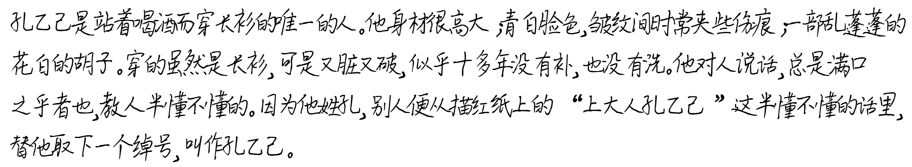
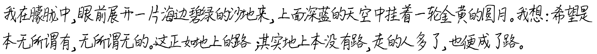
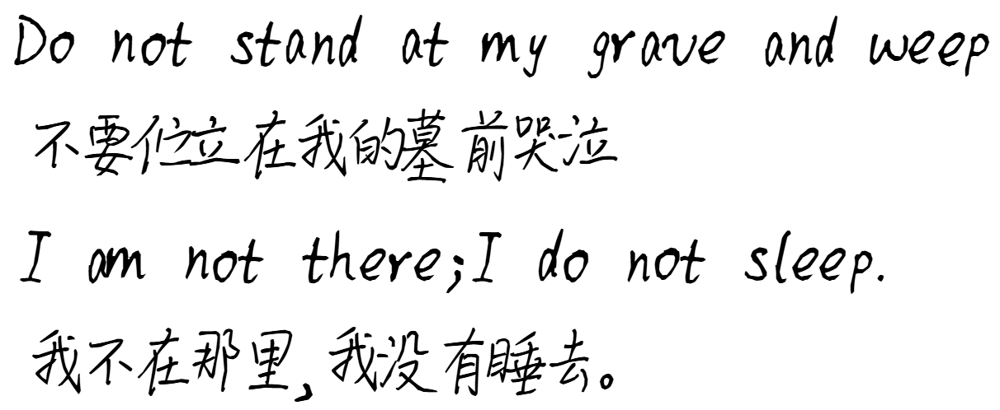

# README

---

## 以假乱真的中英文手写模拟器

### 示例

* Example 1

* Example 2

* Example 3

---

### 使用Tips

* 修改`sampleText`的内容为自己想要的
* 可以在`random_styled_text.html`文件中更改
  * 最大行宽`maxLineWidth`
  * 字号随机范围`fontSize`
  * 字体随机旋转`rotation`
  * 字体垂直位置随机偏移`verticalOffset`
  * 字体重叠幅度（不同类重叠幅度不同）`margin-left`, `margin-right`
  * 字符间距`letter-spacing`
* 用\n手动换行，如果宽度达到了自动换行阈值，加入手动换行符\n会出现空行，此时可以删去\n
* 如果遇到数字和英文单词重叠过多的情况，可以更改重叠参数，或重新打开页面，或手动加入空格
* 可以使用其他手写字体替换`ttf`文件，修改`font-family`

---

### 开发原因

* 部分课程要求提交手写作业电子版，但作业答案很长，抄写是一件耗时且低效的事情。
* Github上已有项目的效果过于工整，无法模仿出写作业、抄写所要求的潦草、连笔等效果。
* 因此耗时三个晚上与AI合作完成本项目，实现每行宽度不完全一样、字体大小随机、字体倾斜角度随机、字体垂直位置随机、字体小幅度重叠等效果，仿手写更加真实自然。
* 截至目前本项目已为人类节省80h时间*★,°*:.☆(￣▽￣)/$:*.°★* .

